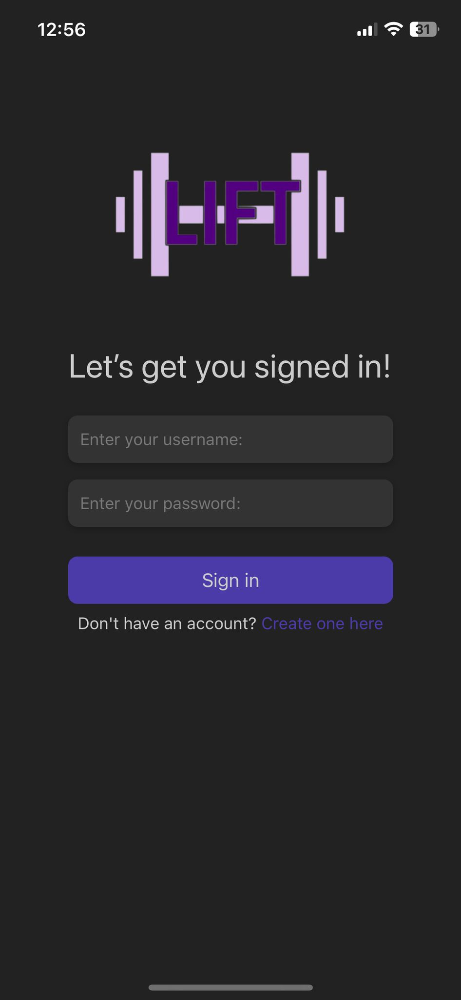
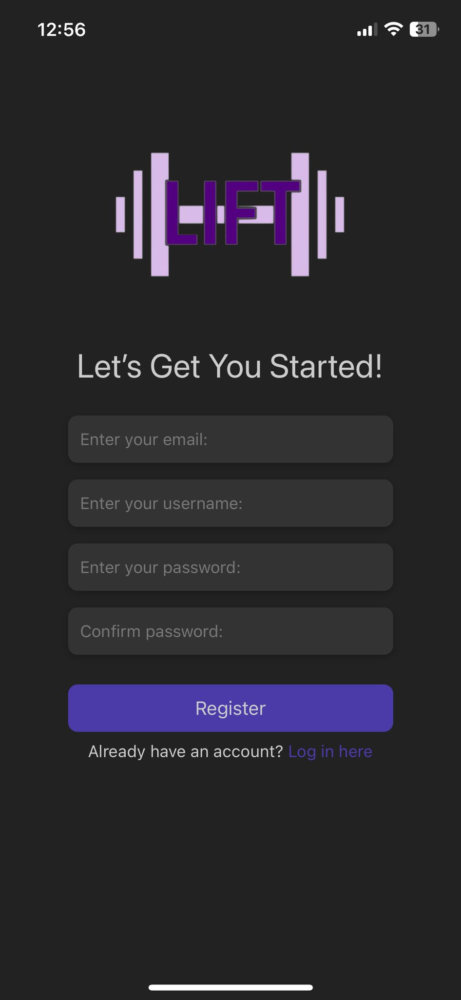
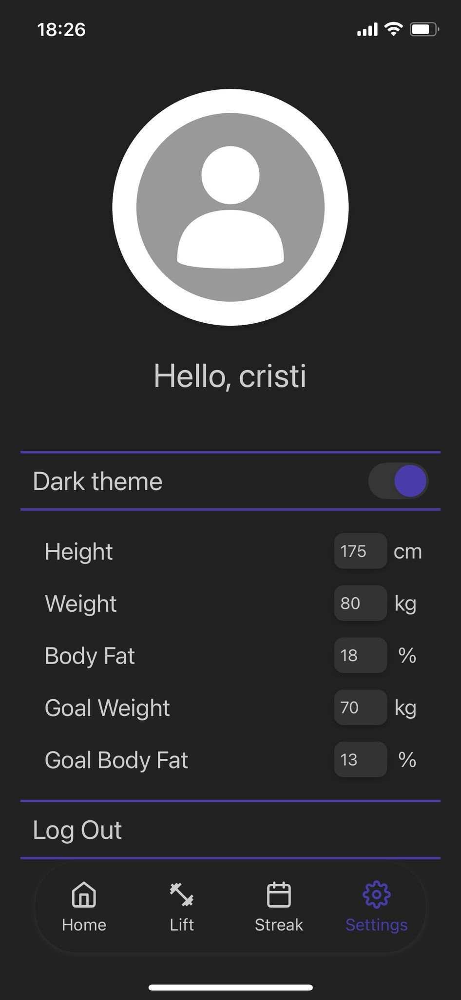
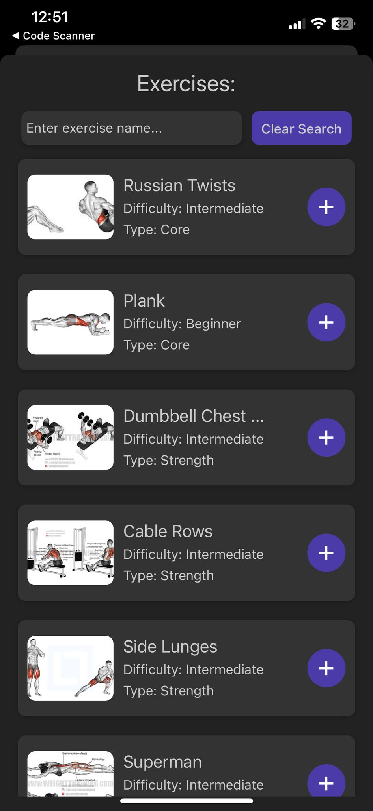
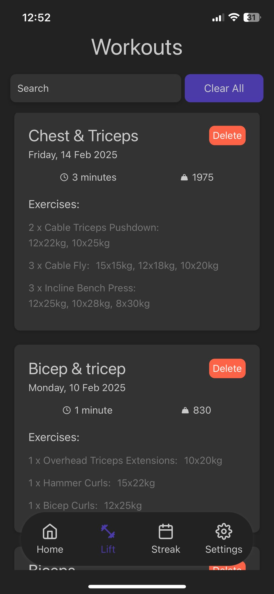
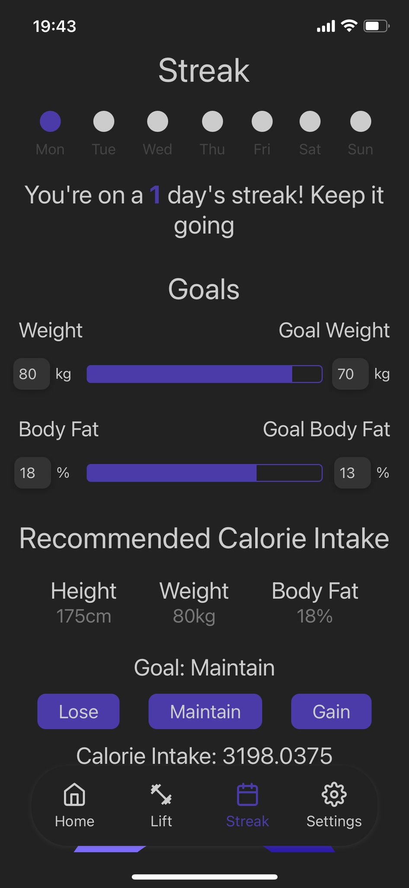
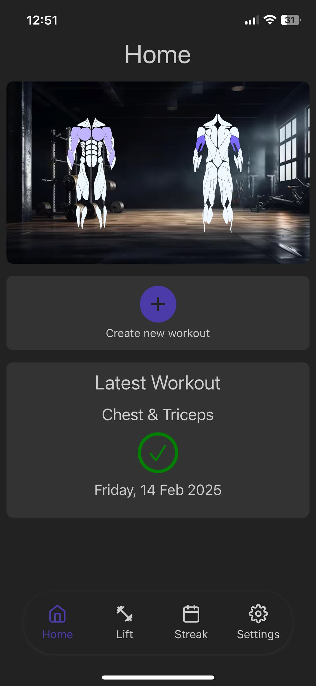
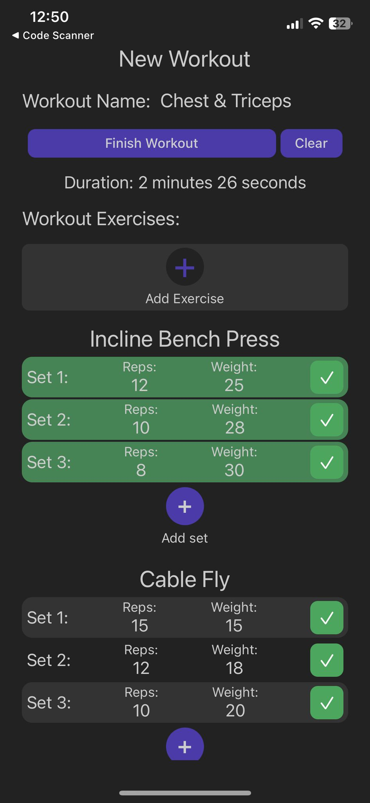

# Backend Overview
#### This backend serves as the API for the LIFT app, providing endpoints for user authentication, data retrieval, and more. It is built using NestJs, Prisma ORM and SQLite.
#### LIFT: https://github.com/dragancristian2005/lift-mobile

### For the Authentication side of the backend:
- **GET**: profile
- **POST**: login
- **POST**: register
- **POST**: profile-picture

#### These endpoints are used for getting the information of a user that is logged in, logging a user in, registering a new user, or changing the user profile picture.

    
    
    

### There is also an exercises method for getting all the exercises, used for displaying all the exercises:
- **GET**: exercises

### On the workout side of the backend there are a lot more methods:
- **GET**: user-workouts, used for getting all the user's workouts.
- **GET**: week-streak, used for getting the user's workout streak.
- **GET**: latest-workout, used for getting the latest workout of the user.
- **GET**: weekly-progress, used for updating the workout heatmap.
- **POST**: create-workout, used for creating a new workout in the database.
- **DELETE**: delete-workout, used for deleting a single workout.
  
- **DELETE**: clear-workouts, used for deleting all the user's workouts.

    
    
    
    

### There is also a user method for updating the user information:
- **POST**: user-info

