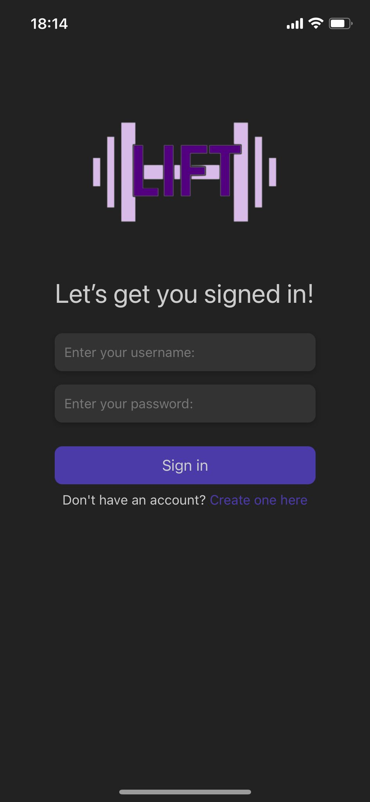
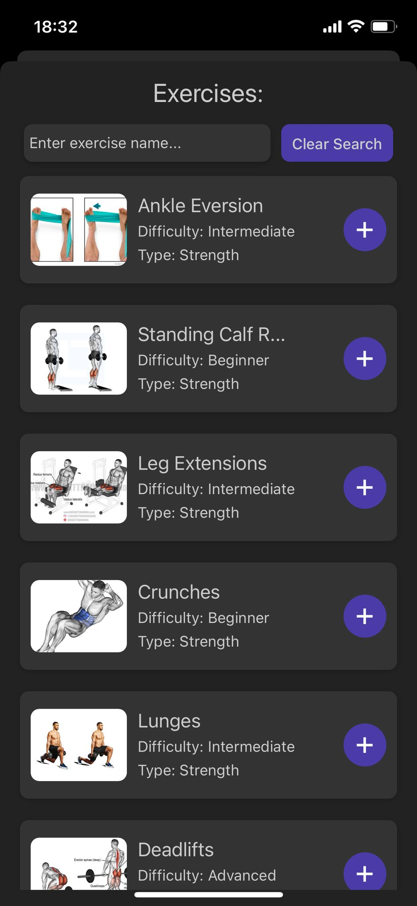
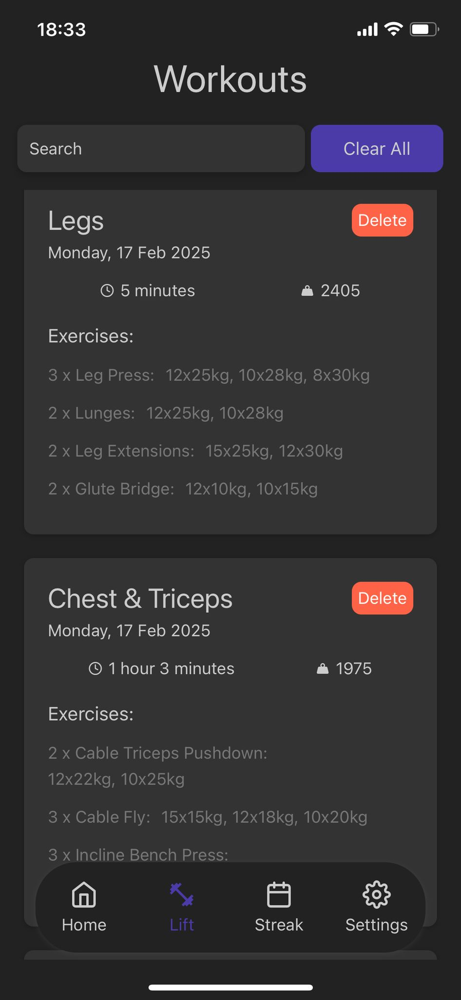
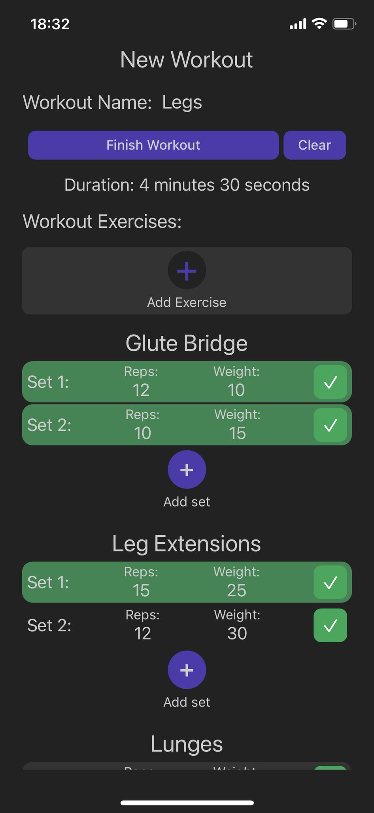

# Backend architecture for LIFT / Gym tracker

This repository contains the backend architecture for [LIFT / Gym tracker](https://github.com/dragancristian2005/lift-mobile) app.
 
Following is a list of endpoints by feature that the server offers:

# Authentication and user settings
- **GET** /profile
- **POST** /login
- **POST** /register
- **POST** /profile-picture
- **POST** /user-info

| Settings                                     | Login                               | Register                               |
|----------------------------------------------|-------------------------------------|----------------------------------------|
|  |  |  |

# Exercises
- **GET** /exercises

| Exercises                                        | Exercise Details                       |
|--------------------------------------------------|----------------------------------------|
|  |  |

# Workouts
- **GET** /user-workouts
- **GET** /latest-workout
- **POST** /create-workout
- **DELETE** /delete-workout
- **DELETE** /clear-workouts

| Workouts                                    | Latest Workout                           | Create Workout                                    |
|---------------------------------------------|------------------------------------------|---------------------------------------------------|
|  |  |  |

# Statistics
- **GET** /week-streak
- **GET** /weekly-progress

| Streak                                     | Heatmap                               | 
|--------------------------------------------|---------------------------------------|
|  |  |
